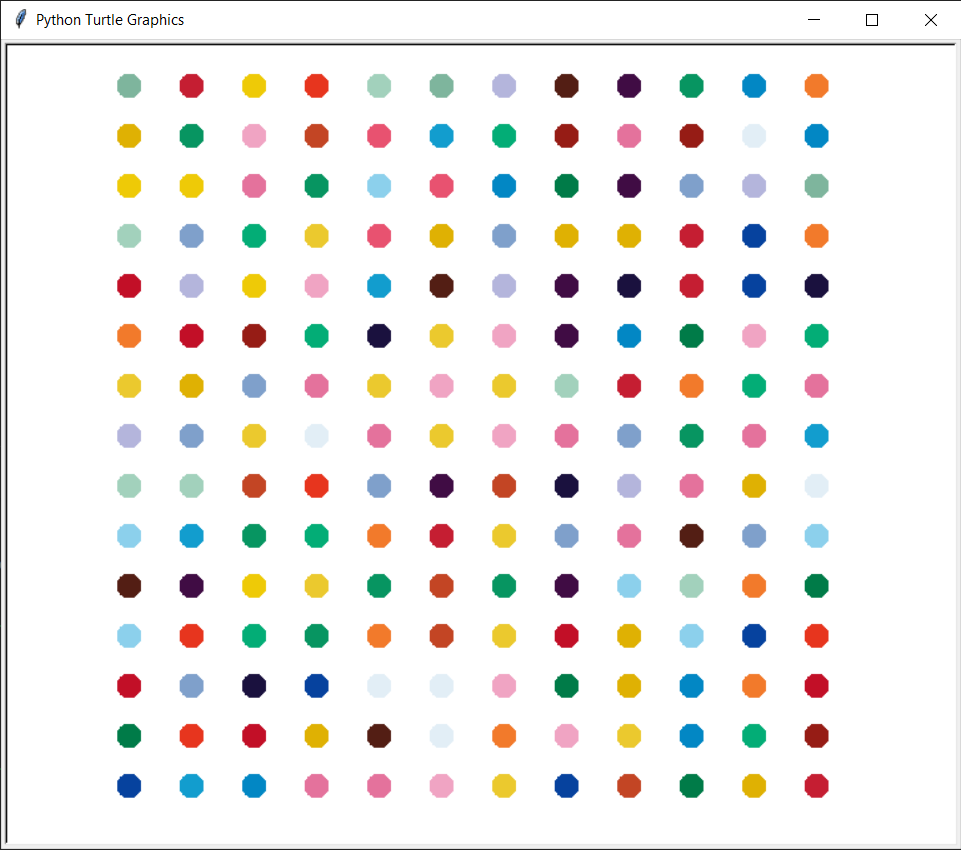
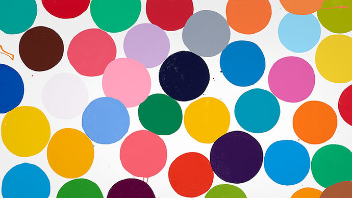

# Hirst Dot Painting 🎨

This Python script creates a colorful dot painting inspired by the style of [Damien Hirst](https://en.wikipedia.org/wiki/Damien_Hirst). It uses the `colorgram` library to extract colors from an image and the `turtle` module to draw a 15×12 grid of colored dots. The script includes error handling and documentation for better usability and clarity.

## ✨ Features
- Extracts up to 30 colors from an input image using `colorgram`.
- Filters out near-white colors (RGB values > 230) for vibrant results.
- Draws a 15×12 grid of 20-pixel dots with randomized colors using `turtle`.
- Includes error handling for missing images or invalid color extraction.
- Documented with comments and a docstring for readability.

## 📸 Example Output


*Example of a generated dot painting using colors extracted from an input image.*

## 🚀 Getting Started

### Prerequisites
- Python 3.6 or higher
- Required library: `colorgram.py`
- The `turtle` module (included in Python's standard library)

### Installation
1. Clone the repository:
   ```bash
   git clone https://github.com/yukamenes/Hirst-Dot-Painting.git
   cd Hirst-Dot-Painting
   ```
2. Install the required library:
   ```bash
   pip install -r requirements.txt
   ```
3. Place an image file named `image.jpg` in the project directory.

### Usage
1. Run the script:
   ```bash
   python main.py
   ```
2. A window will display the dot painting.
3. Click the window to exit.
4. If an error occurs (e.g., missing image), an error message will be printed to the console.

## 📋 Requirements
See the `requirements.txt` file for dependencies:
```
colorgram.py
```

## 🛠️ How It Works
1. The script checks for the existence of `image.jpg` and extracts up to 30 colors using `colorgram`.
2. Colors with RGB values > 230 are filtered out to avoid near-white shades.
3. A 15×12 grid of 20-pixel dots is drawn using `turtle`, with each dot assigned a random color from the extracted palette.
4. The turtle moves in a zigzag pattern with 50-pixel horizontal spacing and 40-pixel vertical spacing.
5. Error handling ensures the script gracefully handles missing files or invalid color extraction.
6. The code includes comments and a docstring for better readability.

## 🖼️ Example Input Image
Use any colorful image as input by placing it in the project directory as `image.jpg`. Here's an example of what an input image might look like:


## 📁 Project Structure
```
Hirst-Dot-Painting/
├── main.py              # Main script to generate the dot painting
├── image.jpg            # Input image for color extraction
├── requirements.txt     # Lists required Python libraries
├── README.md            # Project documentation
├── example_output.png   # Sample output of the dot painting
├── LICENSE              # Creative Commons CC0 1.0 Universal license
├── .gitignore           # Ignores temporary files and directories
```

## 🙌 Contributing
Contributions are welcome! Feel free to fork the repository, make improvements, and submit pull requests.

## 📜 License
This project is licensed under the [Creative Commons CC0 1.0 Universal](LICENSE) license. You are free to use, copy, modify, and distribute this project without restrictions.

---

Made with ❤️ using Python 🐍
